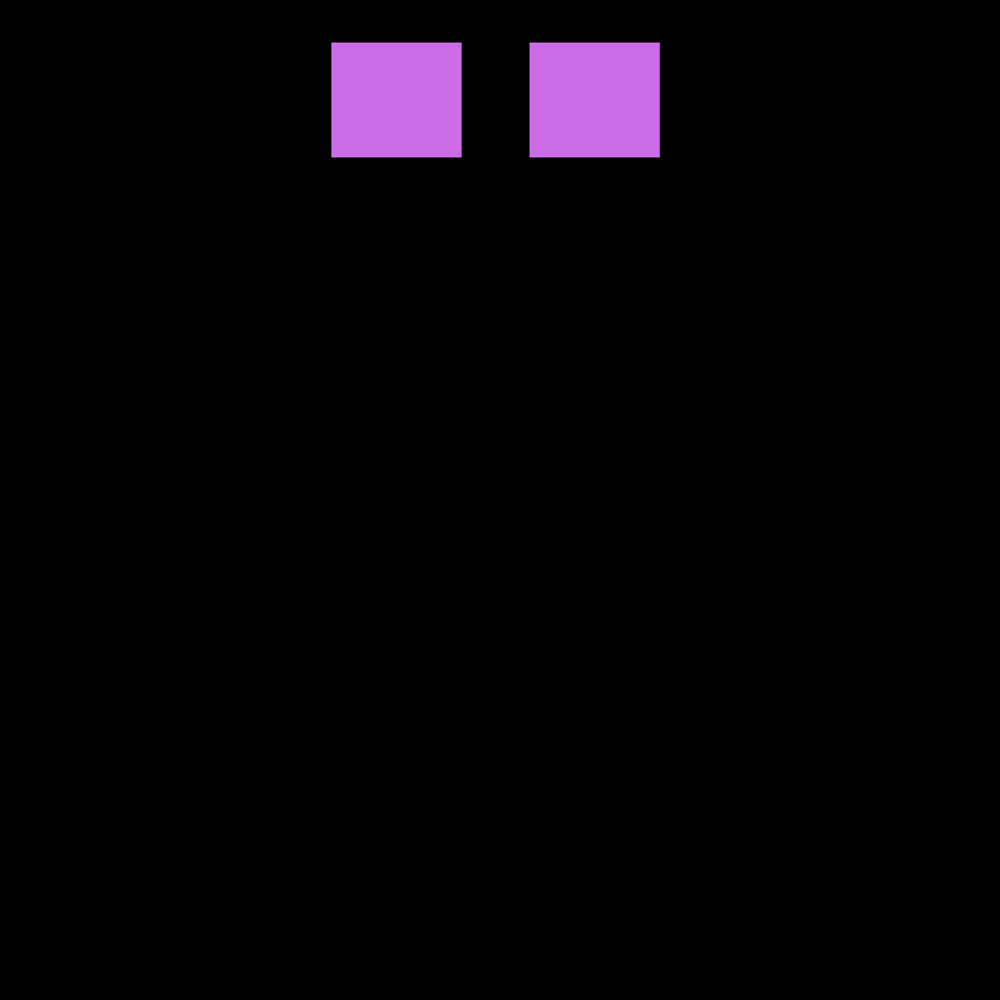
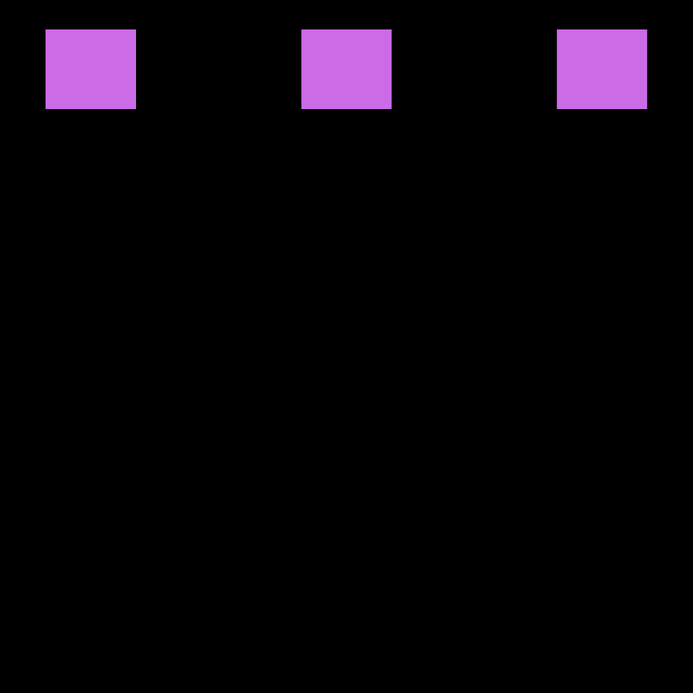
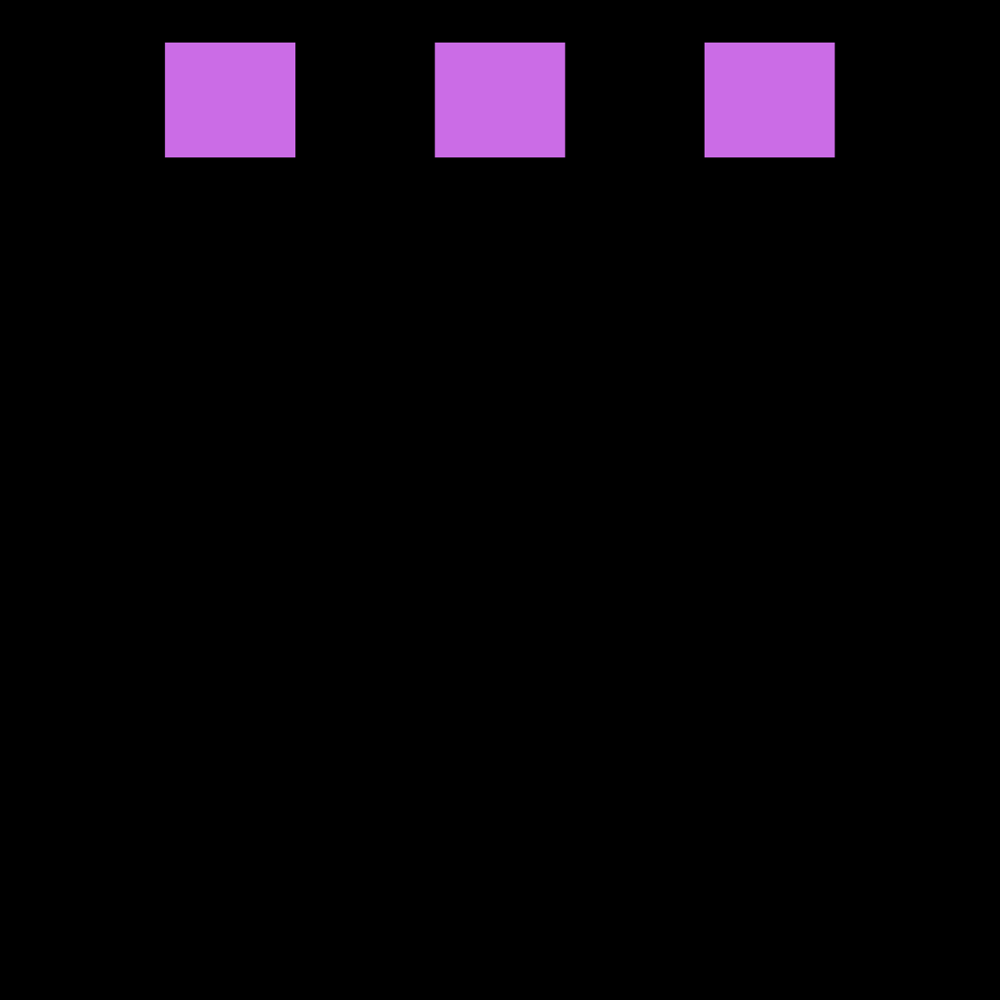
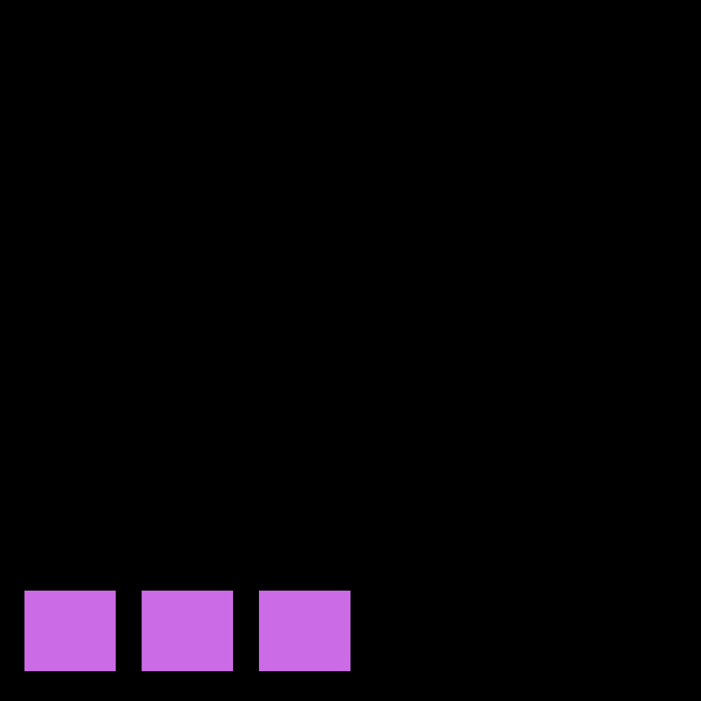
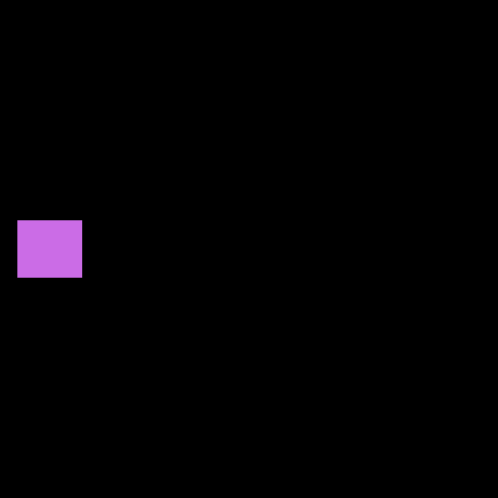

### Justify-content:

Flex-start: os itens se alinham no lado esquerdo do contêiner.

Flex-end: os itens se alinham no lado direito do contêiner.

  

Center: os itens se alinham no centro do contêiner.

  

space-between: os itens são exibidos com espaçamento igual entre eles.

  

space-around: os itens são exibidos com espaçamento igual ao redor deles.

  

### Align-items:

flex-start: os itens se alinham na parte superior do contêiner.

flex-end: os itens se alinham na parte inferior do contêiner.

  

center: os itens se alinham no centro vertical do contêiner.

  

baseline: os itens são exibidos na linha de base do contêiner.

stretch: os itens são esticados para caber no contêiner.
